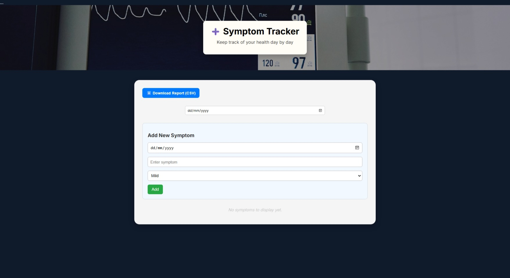
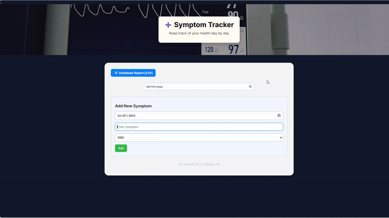

# 🩺 Symptom Tracker App

This is a React-based symptom tracker that helps users log and manage their daily health symptoms. You can add, edit, delete, and save symptoms to a downloadable CSV report.

> ✨ **Design Refresh – July 2025:**  
> Updated with a polished header, cleaner layout, consistent button styling, and improved spacing for a more professional and responsive UI.

---

## 🚀 Features

- Add, edit, and delete symptoms
- Save symptoms to a report
- Download report as CSV
- Filter symptoms by date
- Data persists in local storage
- Clean, responsive, accessible design

---

## 🛠️ Technologies Used

- React (Hooks: `useState`, `useEffect`)
- JavaScript (ES6+)
- HTML5 & CSS3
- LocalStorage for persistence
- CSV export functionality

---

## 📚 What I Learned

- Learned how to manage form input and state in React using `useState`
- Learned how to save and load data using the browser’s LocalStorage
- Built editable and deletable item lists with filtering
- Used conditional rendering for dynamic views and empty states
- Exported structured data into a downloadable CSV format
- Created a clean, mobile-friendly UI using modern CSS

---

## 💡 Future Improvements

- Dark mode toggle
- Export as PDF
- User authentication and login
- Mobile-first UX refinements

---

## 🖼️ Screenshot

---

## 📸 Demo

---

## 🔗 Live Demo

👉 [View the Symptom Tracker App](https://symptom-tracker-seren.netlify.app)