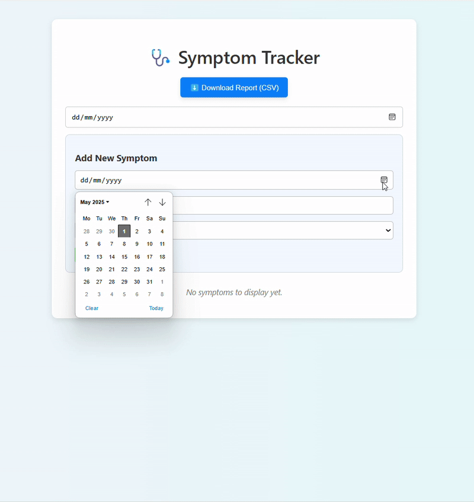

# 🩺 Symptom Tracker App

This is a React-based symptom tracker that helps users log and manage their daily health symptoms. You can add, edit, delete, and save symptoms to a downloadable CSV report.

---

## 🚀 Features

- Add, edit, and delete symptoms
- Save symptoms to a report
- Download symptom report as CSV
- Filter symptoms by date
- Local storage support (data saved in browser)
- Clean, responsive UI

---

## 🛠️ Technologies Used

- React (with Hooks)
- JavaScript (ES6+)
- HTML5 & CSS3
- LocalStorage
- CSV export functionality

---

## 📚 What I Learned

- Managing state and forms in React
- Using `useState` and `useEffect`
- Working with arrays (map, filter)
- Storing data in the browser
- Building and styling a modern UI
- Exporting structured data to CSV

---

## 💡 Future Improvements

- Dark mode toggle
- Export as PDF
- User authentication
- Mobile-first improvements

## 📸 Demo

## 🔗 Live Demo

[View the Symptom Tracker App](https://symptom-tracker-seren.netlify.app)

